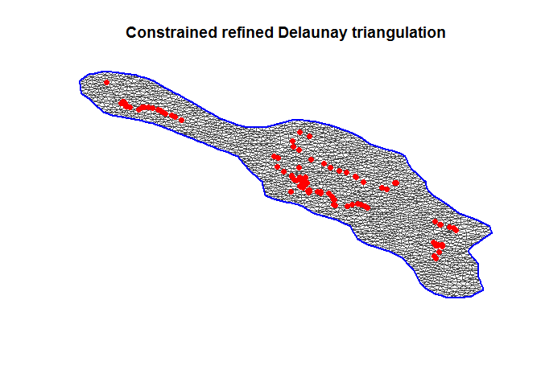
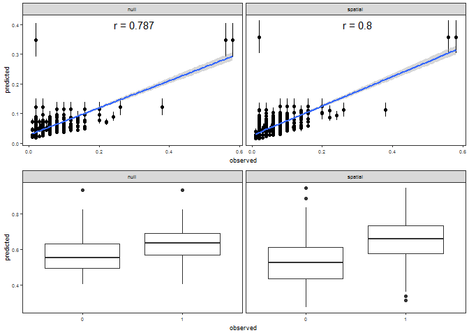
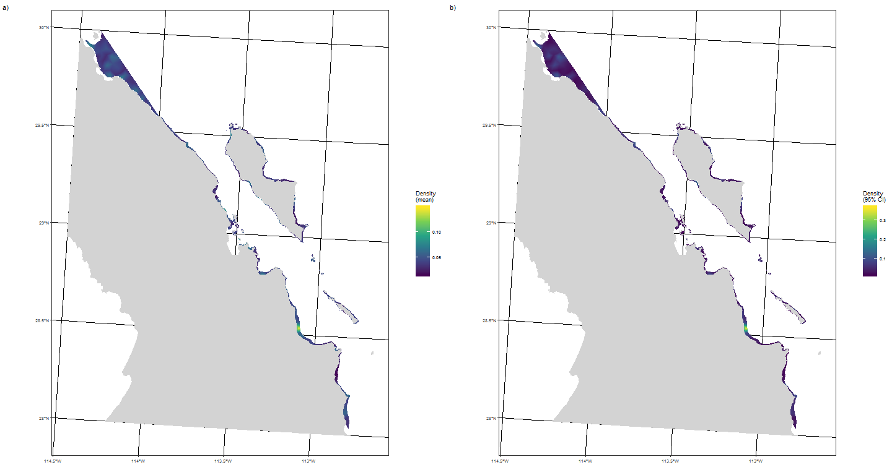
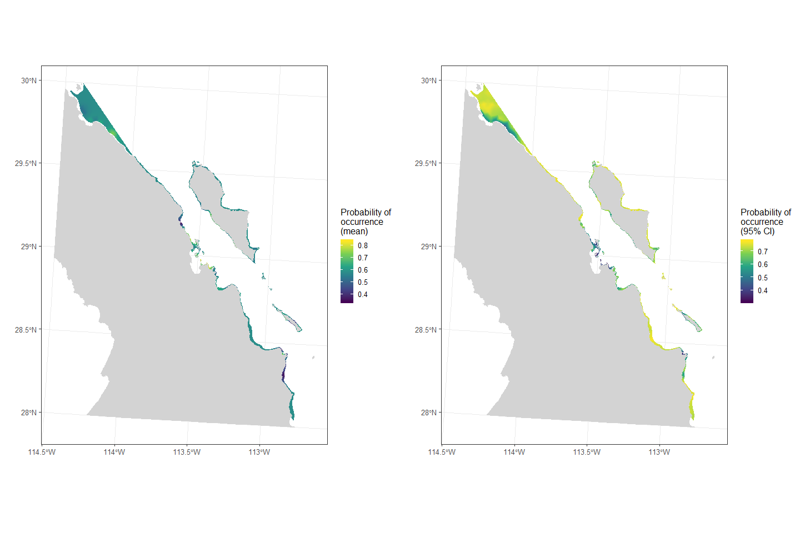

## Aim

In this analysis we want to create spatial estimates of sea cucumber abundance within the < 30m depth region of the Gulf of California. 

## Data


```r
# sea cucumber abundance and some environmental variables
dat <- read_csv("data/sea_cucumber_data.csv", na = c("", "NA", "ND")) %>% 
  select(site_name, latitude, longitude, date, sc_density) %>% 
  mutate(longitude = -longitude,
         date = dmy(date),
         month = str_sub(date, 1, 7),
         z = case_when(sc_density == 0 ~ 0, 
                       TRUE ~ 1),
         y = case_when(sc_density == 0 ~ NaN,
                       TRUE ~ sc_density)) %>% 
  st_as_sf(coords = c("longitude", "latitude"), 
           crs = 4326) %>% 
  st_transform(crs_ea_mex)
```

```
## Parsed with column specification:
## cols(
##   site_name = col_character(),
##   latitude = col_double(),
##   longitude = col_double(),
##   date = col_character(),
##   air_temp = col_double(),
##   wind = col_double(),
##   salinity = col_double(),
##   diss_o2 = col_double(),
##   transect = col_integer(),
##   depth = col_double(),
##   toc = col_double(),
##   sc_density = col_double(),
##   longitude2 = col_double()
## )
```

We have 1107 observations of sea cucumber densities. These are from 118 sites, collected between 2014-10-16 and 2015-09-12.

### Data exploration

What do the sea cucumber densities look like. 


```r
ggplot(data = dat, aes(x = sc_density)) + 
  geom_histogram(binwidth = 0.01)
```

<!-- -->

Non-zero density ranges from 10^{-4} to 0.0058; we will model the abundances (*100) as a negative binomial hurdle model. Occurrence will be fitted with a binomial model. 

### Spatial data

We only want to model and predict within the < 30m depth zone, so let's load this data, plot and create some prediction points. 


```r
# set the boundary for analysis
# currently fixing these boundaries so that we don't get the wide bit - revisit
bounds <- c(xmin = -114.5, ymin = 28, xmax = -112.5, ymax = 30)

# load in the depth data and crop to analysis region
depth_sf <- st_read("data/30m_isobath_baja_california.kml") %>% 
  st_crop(bounds) %>% 
  st_cast("POLYGON") %>% 
  st_zm() %>% 
  st_transform(crs_ea_mex) %>% 
  st_buffer(0) %>% 
  filter(Name != 0) %>% 
  st_cast("MULTIPOLYGON")
```

```
## Reading layer `Isobata Baja California' from data source `C:\Users\lg1u16\GIT_PROJECTS\SIDEPROJ\sea_cucumber\data\30m_isobath_baja_california.kml' using driver `KML'
## Simple feature collection with 33 features and 2 fields
## geometry type:  MULTILINESTRING
## dimension:      XYZ
## bbox:           xmin: -118.3721 ymin: 27.96276 xmax: -112.7483 ymax: 32.52787
## epsg (SRID):    4326
## proj4string:    +proj=longlat +datum=WGS84 +no_defs
```

```
## although coordinates are longitude/latitude, st_intersection assumes that they are planar
```

```
## Warning: attribute variables are assumed to be spatially constant
## throughout all geometries
```

```r
# load in the land shapefile and crop to analysis region
map_sf <- st_read("data/bc_shp/bc_municipio.shp") %>% 
  st_crop(bounds) %>% 
  st_transform(crs_ea_mex)
```

```
## Reading layer `bc_municipio' from data source `C:\Users\lg1u16\GIT_PROJECTS\SIDEPROJ\sea_cucumber\data\bc_shp\bc_municipio.shp' using driver `ESRI Shapefile'
## Simple feature collection with 5 features and 4 fields
## geometry type:  MULTIPOLYGON
## dimension:      XY
## bbox:           xmin: -118.4076 ymin: 28 xmax: -112.6542 ymax: 32.71865
## epsg (SRID):    4326
## proj4string:    +proj=longlat +ellps=WGS84 +no_defs
```

```
## although coordinates are longitude/latitude, st_intersection assumes that they are planar
```

```
## Warning: attribute variables are assumed to be spatially constant
## throughout all geometries
```

```r
# remove the intersection of land and depth
depth_sf <- st_difference(depth_sf, st_combine(map_sf)) %>% st_cast("MULTIPOLYGON")
```

```
## Warning: attribute variables are assumed to be spatially constant
## throughout all geometries
```

```r
depth_sp <- as(depth_sf, "Spatial")

# create a prediction surface
ras <- raster(extent(depth_sp), crs = crs_ea_mex)

res(ras) <- 100
depth_ras <- fasterize::fasterize(depth_sf %>% st_cast("POLYGON"), ras)
```

```
## Warning in st_cast.sf(., "POLYGON"): repeating attributes for all sub-
## geometries for which they may not be constant
```

```r
pred_dat <- as.data.frame(depth_ras, xy = TRUE) %>% 
  na.omit %>% select(x, y)

ggplot() + 
  geom_sf(data=map_sf, fill = "grey", colour = "grey") +
  geom_sf(data = dat %>% arrange(sc_density), 
             aes(colour = sc_density), size = 3) +
  scale_colour_viridis_c(name = "Sea Cucumber Density") + 
  theme(axis.title = element_blank(),
        legend.position = "bottom")
```

<!-- -->


```r
ggplot() +
  geom_sf(data = dat %>% select(-month), colour = "lightgrey") + 
  geom_sf(data = dat %>% arrange(sc_density), aes(colour = sc_density)) + 
  scale_colour_viridis_c(name = "Sea Cucumber Abundance") + 
  facet_wrap(~month)
```

<!-- -->

Date structure in the sampling, will need to account for. 

## INLA Modelling

We will compare 4 different modelling approaches. All approaches are hurdle models where occurrence is modelled using the binomial distribution and density is modelled using the gamma distribution: 

1. null: Intercept-only model
2. temporal: Model with time as random factor
3. spatial: Spatial structure included as a random field (SPDE Matern correlation)
4. spatio-temporal: model with time as random factor and spatial structure as random field

We will also fit each of these with site as a random factor in addition. 

### INLA Mesh

We need a spatial mesh to create the spatial random field. This will be restricted to the convex hull around the prediction points. 


```r
# Create mesh
pred_dat <- pred_dat %>% as.matrix
coords_dat <- st_coordinates(dat)

ch <- inla.nonconvex.hull(rbind(pred_dat, coords_dat) %>% as.matrix, convex = -0.05)
```

```
## Warning: 'cBind' is deprecated.
##  Since R version 3.2.0, base's cbind() should work fine with S4 objects
```

```r
# NB this mesh could be smaller - when we've got a good analysis going, need to change it. 
mesh <- inla.mesh.2d(boundary = ch,
                     #offset = 0.1,
                     max.edge = 5000)

# get locs of points and plot the mesh with the pred and obs points
plot(mesh)
#points(pred_dat[,1:2], col = 1, pch = 16, cex = 1)
points(coords_dat, col = 2, pch = 16, cex = 1)
```

<!-- -->

```r
mesh$n
```

```
## [1] 1432
```

```r
# Associate observation locations with mesh vertices
A <- inla.spde.make.A(mesh, loc = coords_dat)
spde <- inla.spde2.matern(mesh, alpha = 2)

A_pred <- inla.spde.make.A(mesh, loc = pred_dat)
```

### INLA Stacks

To model in INLA we need to create data stacks of fitting and prediction data. 


```r
# create the stacks
nobs = nrow(dat)
dat <- mutate(dat, site_name = as.numeric(as.factor(site_name)),
              date = as.numeric(date))
stack_y <- inla.stack(tag = "est.y", 
                      data = list(density = dat$y, # single model
                                  alldata = cbind(dat$y, NA)), # joint model
                      A = list(A, A, 1, 1, 1),
                      effects = list(
                        y_field = 1:spde$n.spde,
                        yc_field = 1:spde$n.spde,
                        y_intercept = rep(1, nobs),
                        site = dat$site_name,
                        date = dat$date))

stack_z <- inla.stack(tag = "est.z", 
                      data = list(occurrence = dat$z, # single model
                                  alldata = cbind(NA, dat$z)), # joint model
                      A = list(A, 1, 1, 1),
                      effects = list(
                        z_field = 1:spde$n.spde,
                        z_intercept = rep(1, nobs),
                        site = dat$site_name,
                        date = dat$date))

stack_yz <- inla.stack(stack_y, stack_z)
```

### INLA Fitting

Finally, we're going to run the model. We will use a hurdle model approach (binomial for occupancy, negbin for abundance). To do this, we are following Chapter Six of the [INLA SPDE Tutorial](https://folk.ntnu.no/fuglstad/Lund2016/Session6/spde-tutorial.pdf). 


```r
# 1. Null (intercept only)
f_null <- alldata ~ -1 + z_intercept + y_intercept
m_null <- inla(f_null, family = c("gamma", "binomial"),
               data = inla.stack.data(stack_yz),
               control.predictor = list(A = inla.stack.A(stack_yz)),
               control.compute = list(dic = TRUE))
```

```
## Warning: 'rBind' is deprecated.
##  Since R version 3.2.0, base's rbind() should work fine with S4 objects
```

```r
f_nulls <- alldata ~ -1 + z_intercept + y_intercept + 
  f(site, model = "iid")
m_nulls <- inla(f_nulls, family = c("gamma", "binomial"),
                data = inla.stack.data(stack_yz),
                control.predictor = list(A = inla.stack.A(stack_yz)),
                control.compute = list(dic = TRUE))

# 2. Time only (random date field)
f_time <- alldata ~ -1 + z_intercept + y_intercept + 
  f(date, model = "rw2")
m_time <- inla(f_time, family = c("gamma", "binomial"),
               data = inla.stack.data(stack_yz),
               control.predictor = list(A = inla.stack.A(stack_yz)),
               control.compute = list(dic = TRUE))

f_times <- alldata ~ -1 + z_intercept + y_intercept + 
  f(date, model = "rw2") + 
  f(site, model = "iid")
m_times <- inla(f_times, family = c("gamma", "binomial"),
                data = inla.stack.data(stack_yz),
                control.predictor = list(A = inla.stack.A(stack_yz)),
                control.compute = list(dic = TRUE))

# 3. Space only (random spatial field)
f_spatial <- alldata ~ -1 + z_intercept + y_intercept + 
  f(z_field, model = spde) + 
  f(y_field, model = spde) + 
  f(yc_field, copy = "z_field", fixed = FALSE)

m_spatial <- inla(f_spatial, 
                  family = c("gamma", "binomial"), 
                  data = inla.stack.data(stack_yz),
                  control.predictor = list(A = inla.stack.A(stack_yz)),
                  control.compute = list(dic = TRUE, config = TRUE))

f_spatials <- alldata ~ -1 + z_intercept + y_intercept + 
  f(site, model = "iid") + 
  f(z_field, model = spde) + 
  f(y_field, model = spde) + 
  f(yc_field, copy = "z_field", fixed = FALSE)

m_spatials <- inla(f_spatials, 
                   family = c("gamma", "binomial"), 
                   data = inla.stack.data(stack_yz),
                   control.predictor = list(A = inla.stack.A(stack_yz)),
                   control.compute = list(dic = TRUE, config = TRUE))

# 5. Spatial-temporal model
f_sptemp <- alldata ~ -1 + z_intercept + y_intercept + 
  f(date, model = "rw2") +
  f(z_field, model = spde) +
  f(y_field, model = spde) + 
  f(yc_field, copy = "z_field", fixed = FALSE)

m_sptemp <- inla(f_sptemp, family = c("gamma", "binomial"),
                 data = inla.stack.data(stack_yz),
                 control.predictor = list(A = inla.stack.A(stack_yz)),
                 control.compute = list(dic = TRUE, config = TRUE))

f_sptemps <- alldata ~ -1 + z_intercept + y_intercept + 
  f(date, model = "rw2") +
  f(site, model = "iid") +
  f(z_field, model = spde) +
  f(y_field, model = spde) + 
  f(yc_field, copy = "z_field", fixed = FALSE)

m_sptemps <- inla(f_sptemps, family = c("gamma", "binomial"),
                  data = inla.stack.data(stack_yz),
                  control.predictor = list(A = inla.stack.A(stack_yz)),
                  control.compute = list(dic = TRUE, config = TRUE))

mods <- list(null = m_null, nulls = m_nulls, 
             time = m_time, times = m_times,
             spatial = m_spatial, spatials = m_spatials, 
             sptemp = m_sptemp, sptemps = m_sptemps)

save(mods, file = "results/model_out.Rda")
```

## Model Comparison

### DIC Comparison


```r
load("results/model_out.Rda")

# DIC table
map_dfr(mods, function(x) {
  tibble(dic = x$dic$local.dic, family = x$dic$family) %>% 
    group_by(family) %>% 
    summarise(dic = sum(dic)) %>% 
    filter(family %in% c(1, 2)) %>% 
    mutate(measure = c("Abundance", "Occurrence"))
}, .id = "model") %>% 
  select(-family) %>% 
  spread(measure, dic) %>% 
  arrange(Abundance) %>% 
  kable
```


model       Abundance   Occurrence
---------  ----------  -----------
sptemps     -3118.702     1341.103
times       -3108.143     1358.434
sptemp      -3030.493     1346.428
spatials    -3030.449     1384.139
nulls       -3025.423     1397.179
time        -3016.230     1414.278
spatial     -2843.818     1402.156
null        -2665.004     1486.321

### Predicted vs Observed


```r
dat <- dat %>% st_set_geometry(NULL)
idy <- which(dat[,"y"] > 0)
idz <- which(!is.na(dat$z))

pred_vals <- map_dfr(mods, function(x) {
  df <- tibble(predicted = x$summary.fitted.values$mean, 
             pred_sd = x$summary.fitted.values$sd)
  df[idy, "measure"] <- "Density"
  df[idy, "observed"] <- (dat$y) %>% na.omit
  df[idz + nrow(dat), "measure"] <- "Occurrence"
  df[idz + nrow(dat), "observed"] <- dat$z %>% na.omit
  return(df)
}, .id = "model") %>% na.omit %>% 
  mutate(model = factor(model,
                        levels = c("null", "time", "spatial", "sptemp", 
                                   "nulls", "times", "spatials", "sptemps"),
                        labels = c("null", "temporal", "spatial", "spatio-temporal", 
                                   "null + site", "temporal + site", "spatial + site", 
                                   "spatio-temporal + site")))

corrs <- pred_vals %>% 
  filter(measure == "Density") %>% 
  select(model, observed, predicted) %>% 
  group_by(model) %>% 
  nest() %>% 
  mutate(corr = map_dbl(data, function(x) cor.test(x$observed, x$predicted)$estimate)) %>% 
  select(model, corr) %>% 
  unnest()

density <- ggplot(pred_vals %>% filter(measure == "Density"), 
                  aes(x = observed, y = predicted)) + 
  geom_point() + 
  geom_errorbar(aes(ymin = predicted - pred_sd, ymax = predicted + pred_sd), width = 0) + 
  annotate("text", x = 0.3, y = 0.4, label = paste0("r = ", round(corrs$corr, 3))) +
  facet_wrap(~ model, nrow = 2) + 
  geom_smooth(method = "lm")

occurrence <- ggplot(pred_vals %>% filter(measure == "Occurrence"), 
                     aes(x = as.factor(observed), y = predicted)) + 
  geom_boxplot() + 
  facet_wrap(~ model, nrow = 2) + 
  labs(x = "observed")

density + occurrence
```

<!-- -->

## Prediction of the response

All predictions use the spatio-temporal model with random effect of site.


```r
# get the id's for each field
samples <- inla.posterior.sample(n = 100000, result = mods$sptemps)

ids <- lapply(c("y_intercept", "y_field", "yc_field",
                "z_intercept", "z_field"),
              function(x) grep(x, rownames(samples[[1]]$latent), fixed = TRUE))

predict_y <- function(s) exp(s$latent[ids[[1]], 1] + 
                               s$latent[ids[[2]], 1] + 
                               s$latent[ids[[3]], 1])

predict_z <- function(s) 1/ (1 + exp(-(s$latent[ids[[4]], 1] + 
                                        s$latent[ids[[5]], 1])))


pred_y <- sapply(samples, predict_y)
pred_z <- sapply(samples, predict_z)


projgrid <- inla.mesh.projector(mesh, loc = pred_dat)

pred_vals <- as.tibble(pred_dat) %>% 
  mutate(ymean = inla.mesh.project(projgrid, field = rowMeans(pred_y)),
         ylci = inla.mesh.project(projgrid, field = apply(pred_y, 1, quantile, 0.025)),
         yuci = inla.mesh.project(projgrid, field = apply(pred_y, 1, quantile, 0.975)),
         zmean = inla.mesh.project(projgrid, field = rowMeans(pred_z)),
         zlci = inla.mesh.project(projgrid, field = apply(pred_z, 1, quantile, 0.025)),
         zuci = inla.mesh.project(projgrid, field = apply(pred_z, 1, quantile, 0.975)))
```

### Density predictions


```r
ymean_plot <- ggplot() + 
  geom_sf(data = map_sf, colour = "lightgrey", fill = "lightgrey") + 
  geom_raster(data = pred_vals, aes(x = x, y = y, fill = ymean)) + 
  scale_fill_viridis_c(name = "Density (mean)") + 
  labs(x = "", y = "") 

yci_plot <- ggplot() + 
  geom_sf(data = map_sf, colour = "lightgrey", fill = "lightgrey") +
  geom_raster(data = pred_vals, aes(x = x, y = y, fill = yuci - ylci)) + 
  scale_fill_viridis_c(name = "Density (95% CI)") + 
  labs(x = "", y = "")

ymean_plot + yci_plot
```

<!-- -->

### Occurrence predictions


```r
zmean_plot <- ggplot() + 
  geom_sf(data = map_sf, colour = "lightgrey", fill = "lightgrey") +
  geom_raster(data = pred_vals, aes(x = x, y = y, fill = zmean)) + 
  scale_fill_viridis_c(name = "Probability of\noccurrence\n(mean)") + 
  labs(x = "", y = "")

zci_plot <- ggplot() + 
  geom_sf(data = map_sf, colour = "lightgrey", fill = "lightgrey") +
  geom_raster(data = pred_vals, aes(x = x, y = y, fill = zuci - zlci)) + 
  scale_fill_viridis_c(name = "Probability of\noccurrence\n(95% CI)") + 
  labs(x = "", y = "")

zmean_plot + zci_plot
```

<!-- -->

## Comparison against quotas

We use the shapes from Luis to make predictions of units within the estates for comparison against granted quotas. 


```r
density_mean <- pred_vals %>% 
  select(x, y, ymean) %>% 
  mutate(ymean = ymean * 100) %>% 
  rasterFromXYZ(crs = crs_ea_mex)

density_lci <- pred_vals %>% 
  select(x, y, ylci) %>% 
  mutate(ylci = ylci * 100) %>% 
  rasterFromXYZ(crs = crs_ea_mex)

density_uci <- pred_vals %>% 
  select(x, y, yuci) %>% 
  mutate(yuci = yuci * 100) %>% 
  rasterFromXYZ(crs = crs_ea_mex)

density <- stack(list(mean = density_mean, 
                 lci = density_lci, 
                 uci = density_uci))
```


```r
f <- list.files("data/quota_shp/", pattern = ".shp", full.names = TRUE)

quotas <- rbind(st_read(f[1]) %>% select(NAME, geometry), 
                st_read(f[2]) %>% select(NAME, geometry), 
                st_read(f[3]) %>% select(NAME, geometry)) %>% 
  st_transform(crs_ea_mex)
```

```
## Reading layer `Pepino-Hnos Fuerte SPR de RL' from data source `C:\Users\lg1u16\GIT_PROJECTS\SIDEPROJ\sea_cucumber\data\quota_shp\Pepino-Hnos Fuerte SPR de RL.shp' using driver `ESRI Shapefile'
## Simple feature collection with 1 feature and 2 fields
## geometry type:  POLYGON
## dimension:      XY
## bbox:           xmin: -113.2022 ymin: 29.06086 xmax: -113.0984 ymax: 29.15005
## epsg (SRID):    4326
## proj4string:    +proj=longlat +ellps=WGS84 +no_defs
## Reading layer `Pepino-Joaquin Arturo Ayala' from data source `C:\Users\lg1u16\GIT_PROJECTS\SIDEPROJ\sea_cucumber\data\quota_shp\Pepino-Joaquin Arturo Ayala.shp' using driver `ESRI Shapefile'
## Simple feature collection with 1 feature and 2 fields
## geometry type:  POLYGON
## dimension:      XY
## bbox:           xmin: -113.625 ymin: 29.52507 xmax: -113.5241 ymax: 29.60842
## epsg (SRID):    4326
## proj4string:    +proj=longlat +ellps=WGS84 +no_defs
## Reading layer `poligonos pepino' from data source `C:\Users\lg1u16\GIT_PROJECTS\SIDEPROJ\sea_cucumber\data\quota_shp\poligonos pepino.shp' using driver `ESRI Shapefile'
## Simple feature collection with 7 features and 3 fields
## geometry type:  POLYGON
## dimension:      XY
## bbox:           xmin: -113.6568 ymin: 27.99996 xmax: -112.675 ymax: 29.28334
## epsg (SRID):    4326
## proj4string:    +proj=longlat +ellps=WGS84 +no_defs
```

```r
ggplot() + geom_sf(data = quotas, aes(fill = NAME))
```

<!-- -->

```r
quotas_sp <- as(quotas, "Spatial")
```


```r
quota_preds <- raster::extract(density, quotas_sp, fun = sum, na.rm = TRUE) %>% as_tibble

quota_area <- raster::extract(density, quotas_sp) %>% 
  map_dfr(function(x) {
    tibble(suitable_area = x %>% na.omit %>% nrow)
  })

bind_cols(quotas, quota_preds, quota_area) %>% st_set_geometry(NULL) %>% write_csv("results/quotas.csv") %>% kable
```


NAME                                            mean         lci         uci   suitable_area
----------------------------------------  ----------  ----------  ----------  --------------
PEPINO-Hnos. Fuerte SPR de RL               3077.023   1086.0724    6868.899             787
Pepino-Joaquin Arturo Ayala                 3374.111   1322.0940    7154.537             889
Pepino-Pescadores del Barril-1             18398.221   6232.7167   42058.424            5127
Pepino-Pescadores del Barril-2              1726.711    703.2547    3529.801             517
Pepino-Buzos de Bahía                      11148.385   5637.1713   20442.025            2349
Pepino-Buzosy PescadoresdeBC                4950.083   1961.6010   10546.602            1105
Pepino-Maria del Socorro Garcia Alvares     5529.782   2439.0929   10943.744            1219
Pepino-Marina Canizales Garcia              9418.068   3690.8638   20118.285            2367
Pepino-MorenoLeonGuillermo                  5449.896   1984.7176   11900.968            1576

