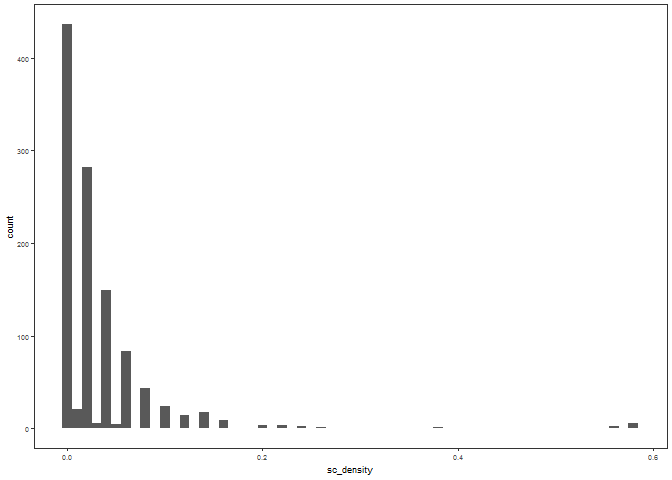
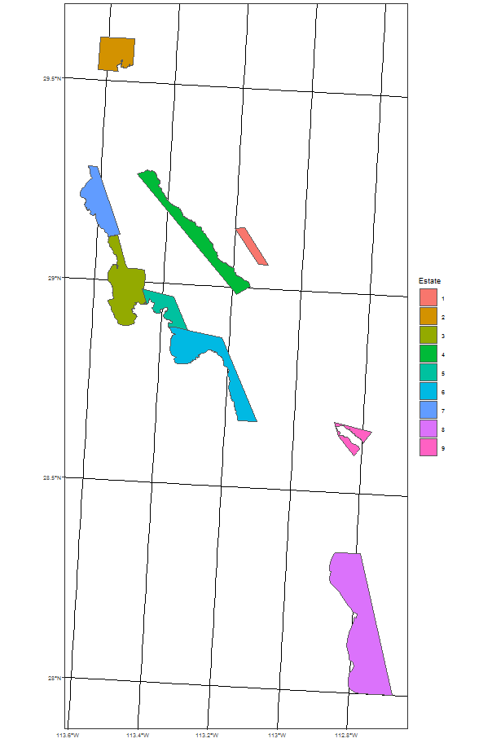
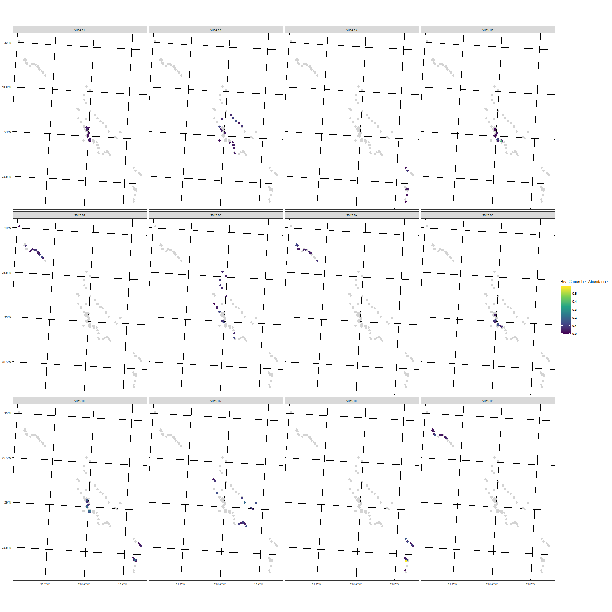
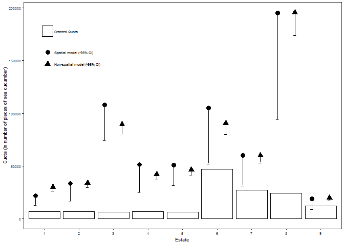

## Aim

In this analysis we want to create spatial estimates of sea cucumber abundance within the < 30m depth region of the Gulf of California. 

## Data


```r
# sea cucumber abundance and some environmental variables
dat <- read_csv("data/sea_cucumber_data.csv", na = c("", "NA", "ND")) %>% 
  select(site_name, latitude, longitude, date, sc_density) %>% 
  mutate(longitude = -longitude,
         date = dmy(date),
         month = str_sub(date, 1, 7),
         z = case_when(sc_density == 0 ~ 0, 
                       TRUE ~ 1),
         y = case_when(sc_density == 0 ~ NaN,
                       TRUE ~ sc_density)) %>% 
  st_as_sf(coords = c("longitude", "latitude"), 
           crs = 4326) %>% 
  st_transform(crs_ea_mex)
```

We have 1107 observations of sea cucumber densities. These are from 118 sites, collected between 2014-10-16 and 2015-09-12.

### Data exploration

What do the sea cucumber densities look like. 


```r
ggplot(data = dat, aes(x = sc_density)) + 
  geom_histogram(binwidth = 0.01)
```

<!-- -->

Non-zero density ranges from 10^{-4} to 0.0058; we will model the abundances (*100) as a negative binomial hurdle model. Occurrence will be fitted with a binomial model. 

### Spatial data

We only want to model and predict within the < 30m depth zone, so let's load this data, plot and create some prediction points. 


```r
# set the boundary for analysis
# currently fixing these boundaries so that we don't get the wide bit - revisit
bounds <- c(xmin = -114.5, ymin = 28, xmax = -112.5, ymax = 30)

# load in the depth data and crop to analysis region
depth_sf <- st_read("data/30m_isobath_baja_california.kml") %>% 
  st_crop(bounds) %>% 
  st_cast("POLYGON") %>% 
  st_zm() %>% 
  st_transform(crs_ea_mex) %>% 
  st_buffer(0) %>% 
  filter(Name != 0) %>% 
  st_cast("MULTIPOLYGON")
```

```
## Reading layer `Isobata Baja California' from data source `C:\Users\lg1u16\GIT_PROJECTS\SIDEPROJ\sea_cucumber\data\30m_isobath_baja_california.kml' using driver `KML'
## Simple feature collection with 33 features and 2 fields
## geometry type:  MULTILINESTRING
## dimension:      XYZ
## bbox:           xmin: -118.3721 ymin: 27.96276 xmax: -112.7483 ymax: 32.52787
## epsg (SRID):    4326
## proj4string:    +proj=longlat +datum=WGS84 +no_defs
```

```r
# load in the land shapefile and crop to analysis region
map_sf <- st_read("data/bc_shp/bc_municipio.shp") %>% 
  st_crop(bounds) %>% 
  st_transform(crs_ea_mex)
```

```
## Reading layer `bc_municipio' from data source `C:\Users\lg1u16\GIT_PROJECTS\SIDEPROJ\sea_cucumber\data\bc_shp\bc_municipio.shp' using driver `ESRI Shapefile'
## Simple feature collection with 5 features and 4 fields
## geometry type:  MULTIPOLYGON
## dimension:      XY
## bbox:           xmin: -118.4076 ymin: 28 xmax: -112.6542 ymax: 32.71865
## epsg (SRID):    4326
## proj4string:    +proj=longlat +ellps=WGS84 +no_defs
```

```r
# remove the intersection of land and depth
depth_sf <- st_difference(depth_sf, st_combine(map_sf)) %>% st_cast("MULTIPOLYGON")

depth_sp <- as(depth_sf, "Spatial")

# create a prediction surface
ras <- raster(extent(depth_sp), crs = crs_ea_mex)

res(ras) <- 100
depth_ras <- fasterize::fasterize(depth_sf %>% st_cast("POLYGON"), ras)

pred_dat <- as.data.frame(depth_ras, xy = TRUE) %>% 
  na.omit %>% select(x, y)

f <- list.files("data/quota_shp/", pattern = ".shp", full.names = TRUE)

quotas <- st_read("data/quota_estates.shp")
```

```
## Reading layer `quota_estates' from data source `C:\Users\lg1u16\GIT_PROJECTS\SIDEPROJ\sea_cucumber\data\quota_estates.shp' using driver `ESRI Shapefile'
## Simple feature collection with 9 features and 2 fields
## geometry type:  POLYGON
## dimension:      XY
## bbox:           xmin: -834829.8 ymin: 467940.9 xmax: -747391.8 ymax: 652551.7
## epsg (SRID):    NA
## proj4string:    +proj=aea +lat_1=14.5 +lat_2=32.5 +lat_0=24 +lon_0=-105 +x_0=0 +y_0=0 +ellps=GRS80 +units=m +no_defs
```

```r
ggplot() + geom_sf(data = quotas, aes(fill = Estate))
```

<!-- -->

```r
quotas_sp <- as(quotas, "Spatial")

study_site <- ggplot() + 
  geom_sf(data=map_sf, fill = "grey", colour = "grey") +
  geom_sf(data = quotas) +
  geom_sf(data = dat %>% arrange(sc_density), 
             aes(colour = sc_density)) +
  scale_colour_viridis_c(name = "Sea Cucumber\nDensity") + 
  theme(axis.title = element_blank(),
        panel.grid.major=element_line(colour="transparent")) 

ggsave(plot = study_site, filename = "figures/study_site.jpg", dpi = 300, width = 140, units = "mm")
```


```r
ggplot() +
  geom_sf(data = dat %>% select(-month), colour = "lightgrey") + 
  geom_sf(data = dat %>% arrange(sc_density), aes(colour = sc_density)) + 
  scale_colour_viridis_c(name = "Sea Cucumber Abundance") + 
  facet_wrap(~month)
```

<!-- -->

Date structure in the sampling, will need to account for. 

## INLA Modelling

We will compare 4 different modelling approaches. All approaches are hurdle models where occurrence is modelled using the binomial distribution and density is modelled using the gamma distribution: 

1. null: Intercept-only model
2. temporal: Model with time as random factor
3. spatial: Spatial structure included as a random field (SPDE Matern correlation)
4. spatio-temporal: model with time as random factor and spatial structure as random field

We will also fit each of these with site as a random factor in addition. 

### INLA Mesh

We need a spatial mesh to create the spatial random field. This will be restricted to the convex hull around the prediction points. 


```r
# Create mesh
pred_dat <- pred_dat %>% as.matrix
coords_dat <- st_coordinates(dat)

ch <- inla.nonconvex.hull(rbind(pred_dat, coords_dat) %>% as.matrix, convex = -0.05)

# NB this mesh could be smaller - when we've got a good analysis going, need to change it. 
mesh <- inla.mesh.2d(boundary = ch,
                     #offset = 0.1,
                     max.edge = 5000)

# get locs of points and plot the mesh with the pred and obs points
plot(mesh)
#points(pred_dat[,1:2], col = 1, pch = 16, cex = 1)
points(coords_dat, col = 2, pch = 16, cex = 1)
```

<!-- -->

```r
mesh$n
```

```
## [1] 1432
```

```r
# Associate observation locations with mesh vertices
A <- inla.spde.make.A(mesh, loc = coords_dat)
spde <- inla.spde2.matern(mesh, alpha = 2)

A_pred <- inla.spde.make.A(mesh, loc = pred_dat)
```

### INLA Stacks

To model in INLA we need to create data stacks of fitting and prediction data. 


```r
# create the stacks
nobs = nrow(dat)
dat <- mutate(dat, site_name = as.numeric(as.factor(site_name)),
              date = as.numeric(date))
stack_y <- inla.stack(tag = "est.y", 
                      data = list(alldata = cbind(dat$y, NA), link = 1), 
                      A = list(A, A, 1, 1, 1),
                      effects = list(
                        y_field = 1:spde$n.spde,
                        yc_field = 1:spde$n.spde,
                        y_intercept = rep(1, nobs),
                        site = dat$site_name,
                        date = dat$date))

stack_z <- inla.stack(tag = "est.z", 
                      data = list(alldata = cbind(NA, dat$z), link = 2), 
                      A = list(A, 1, 1, 1),
                      effects = list(
                        z_field = 1:spde$n.spde,
                        z_intercept = rep(1, nobs),
                        site = dat$site_name,
                        date = dat$date))

stack_yz <- inla.stack(stack_y, stack_z)
```

### INLA Fitting

Finally, we're going to run the model. We will use a hurdle model approach (binomial for occupancy, negbin for abundance). To do this, we are following Chapter Six of the [INLA SPDE Tutorial](https://folk.ntnu.no/fuglstad/Lund2016/Session6/spde-tutorial.pdf). 


```r
# 1. Null (intercept only)
f_null <- alldata ~ -1 + z_intercept + y_intercept
m_null <- inla(f_null, family = c("gamma", "binomial"),
               data = inla.stack.data(stack_yz),
               control.predictor = list(A = inla.stack.A(stack_yz)),
               control.compute = list(dic = TRUE))

f_nulls <- alldata ~ -1 + z_intercept + y_intercept + 
  f(site, model = "iid")
m_nulls <- inla(f_nulls, family = c("gamma", "binomial"),
                data = inla.stack.data(stack_yz),
                control.predictor = list(A = inla.stack.A(stack_yz)),
                control.compute = list(dic = TRUE))

# 2. Time only (random date field)
f_time <- alldata ~ -1 + z_intercept + y_intercept + 
  f(date, model = "rw2")
m_time <- inla(f_time, family = c("gamma", "binomial"),
               data = inla.stack.data(stack_yz),
               control.predictor = list(A = inla.stack.A(stack_yz)),
               control.compute = list(dic = TRUE))

f_times <- alldata ~ -1 + z_intercept + y_intercept + 
  f(date, model = "rw2") + 
  f(site, model = "iid")
m_times <- inla(f_times, family = c("gamma", "binomial"),
                data = inla.stack.data(stack_yz),
                control.predictor = list(A = inla.stack.A(stack_yz)),
                control.compute = list(dic = TRUE, config = TRUE))

# 3. Space only (random spatial field)
f_spatial <- alldata ~ -1 + z_intercept + y_intercept + 
  f(z_field, model = spde) + 
  f(y_field, model = spde) + 
  f(yc_field, copy = "z_field", fixed = FALSE)

m_spatial <- inla(f_spatial, 
                  family = c("gamma", "binomial"), 
                  data = inla.stack.data(stack_yz),
                  control.predictor = list(A = inla.stack.A(stack_yz)),
                  control.compute = list(dic = TRUE, config = TRUE))

f_spatials <- alldata ~ -1 + z_intercept + y_intercept + 
  f(site, model = "iid") + 
  f(z_field, model = spde) + 
  f(y_field, model = spde) + 
  f(yc_field, copy = "z_field", fixed = FALSE)

m_spatials <- inla(f_spatials, 
                   family = c("gamma", "binomial"), 
                   data = inla.stack.data(stack_yz),
                   control.predictor = list(A = inla.stack.A(stack_yz)),
                   control.compute = list(dic = TRUE, config = TRUE))

# 5. Spatial-temporal model
f_sptemp <- alldata ~ -1 + z_intercept + y_intercept + 
  f(date, model = "rw2") +
  f(z_field, model = spde) +
  f(y_field, model = spde) + 
  f(yc_field, copy = "z_field", fixed = FALSE)

m_sptemp <- inla(f_sptemp, family = c("gamma", "binomial"),
                 data = inla.stack.data(stack_yz),
                 control.predictor = list(A = inla.stack.A(stack_yz)),
                 control.compute = list(dic = TRUE, config = TRUE))

f_sptemps <- alldata ~ -1 + z_intercept + y_intercept + 
  f(date, model = "rw2") +
  f(site, model = "iid") +
  f(z_field, model = spde) +
  f(y_field, model = spde) + 
  f(yc_field, copy = "z_field", fixed = FALSE)

m_sptemps <- inla(f_sptemps, family = c("gamma", "binomial"),
                  data = inla.stack.data(stack_yz),
                  control.predictor = list(A = inla.stack.A(stack_yz)),
                  control.compute = list(dic = TRUE, config = TRUE))

mods <- list(null = m_null, nulls = m_nulls, 
             time = m_time, times = m_times,
             spatial = m_spatial, spatials = m_spatials, 
             sptemp = m_sptemp, sptemps = m_sptemps)

save(mods, file = "results/model_out.Rda")
```

## Model Comparison

### DIC Comparison


```r
load("results/model_out.Rda")

# DIC table
map_dfr(mods, function(x) {
  tibble(dic = x$dic$local.dic, family = x$dic$family) %>% 
    group_by(family) %>% 
    summarise(dic = sum(dic)) %>% 
    filter(family %in% c(1, 2)) %>% 
    mutate(measure = c("Abundance", "Occurrence"))
}, .id = "model") %>% 
  select(-family) %>% 
  spread(measure, dic) %>% 
  arrange(Abundance) %>% 
  write_csv("results/dic_table.csv") %>% 
  kable
```


model       Abundance   Occurrence
---------  ----------  -----------
sptemps     -3118.702     1341.103
times       -3108.143     1358.434
sptemp      -3030.493     1346.428
spatials    -3030.449     1384.139
nulls       -3025.423     1397.179
time        -3016.230     1414.278
spatial     -2843.818     1402.156
null        -2665.004     1486.321

### Predicted vs Observed


```r
dat <- dat %>% st_set_geometry(NULL)
idy <- which(dat[,"y"] > 0)
idz <- which(!is.na(dat$z))

pred_vals <- map_dfr(mods[c("nulls", "sptemps")], function(x) {
  df <- tibble(predicted = x$summary.fitted.values$mean, 
             pred_sd = x$summary.fitted.values$sd)
  df[idy, "measure"] <- "Density"
  df[idy, "observed"] <- (dat$y) %>% na.omit
  df[idz + nrow(dat), "measure"] <- "Occurrence"
  df[idz + nrow(dat), "observed"] <- dat$z %>% na.omit
  return(df)
}, .id = "model") %>% na.omit %>% 
  mutate(model = factor(model,
                        levels = c("nulls", "sptemps"),
                        labels = c("null", "spatial")))

corrs <- pred_vals %>% 
  filter(measure == "Density") %>% 
  select(model, observed, predicted) %>% 
  group_by(model) %>% 
  nest() %>% 
  mutate(corr = map_dbl(data, function(x) cor.test(x$observed, x$predicted)$estimate)) %>% 
  select(model, corr) %>% 
  unnest()

density <- ggplot(pred_vals %>% filter(measure == "Density"), 
                  aes(x = observed, y = predicted)) + 
  geom_point() + 
  geom_errorbar(aes(ymin = predicted - pred_sd, ymax = predicted + pred_sd), width = 0) + 
  annotate("text", x = 0.3, y = 0.4, label = paste0("r = ", round(corrs$corr, 3))) +
  facet_wrap(~ model, nrow = 1) + 
  geom_smooth(method = "lm")

occurrence <- ggplot(pred_vals %>% filter(measure == "Occurrence"), 
                     aes(x = as.factor(observed), y = predicted)) + 
  geom_boxplot() + 
  facet_wrap(~ model, nrow = 1) + 
  labs(x = "observed")

density + occurrence + plot_layout(nrow = 2)
```

<!-- -->

### Model summary


```r
summary(mods$sptemps)
```

```
## 
## Call:
## c("inla(formula = f_sptemps, family = c(\"gamma\", \"binomial\"), data = inla.stack.data(stack_yz), ",  "    control.compute = list(dic = TRUE, config = TRUE), control.predictor = list(A = inla.stack.A(stack_yz)))" )
## 
## Time used:
##  Pre-processing    Running inla Post-processing           Total 
##          1.6381        394.8718          1.6211        398.1310 
## 
## Fixed effects:
##                mean     sd 0.025quant 0.5quant 0.975quant    mode   kld
## z_intercept  0.3928 0.1653     0.0572   0.3957     0.7127  0.4012 0.000
## y_intercept -3.3391 0.2771    -3.6044  -3.3357    -3.1058 -3.3283 0.089
## 
## Random effects:
## Name	  Model
##  date   RW2 model 
## site   IID model 
## z_field   SPDE2 model 
## y_field   SPDE2 model 
## yc_field   Copy 
## 
## Model hyperparameters:
##                                                      mean        sd
## Precision parameter for the Gamma observations     3.1119 1.764e-01
## Precision for date                             39764.5662 2.119e+04
## Precision for site                                 5.2277 1.102e+00
## Theta1 for z_field                                 5.8130 7.052e-01
## Theta2 for z_field                                -7.1503 4.478e-01
## Theta1 for y_field                                 9.9323 2.124e+00
## Theta2 for y_field                                -8.2370 2.099e+00
## Beta for yc_field                                  0.4575 9.680e-02
##                                                0.025quant   0.5quant
## Precision parameter for the Gamma observations     2.7797     3.1068
## Precision for date                             12510.5731 35321.3577
## Precision for site                                 3.4016     5.1131
## Theta1 for z_field                                 4.4402     5.8075
## Theta2 for z_field                                -8.0199    -7.1549
## Theta1 for y_field                                 5.6343     9.9880
## Theta2 for y_field                               -11.9589    -8.3938
## Beta for yc_field                                  0.2677     0.4572
##                                                0.975quant       mode
## Precision parameter for the Gamma observations      3.474     3.0967
## Precision for date                              92994.482 27391.4353
## Precision for site                                  7.713     4.8913
## Theta1 for z_field                                  7.212     5.7880
## Theta2 for z_field                                 -6.262    -7.1714
## Theta1 for y_field                                 13.972    10.1868
## Theta2 for y_field                                 -3.769    -8.9724
## Beta for yc_field                                   0.648     0.4564
## 
## Expected number of effective parameters(std dev): 110.64(5.912)
## Number of equivalent replicates : 16.07 
## 
## Deviance Information Criterion (DIC) ...: -1777.60
## Effective number of parameters .........: 113.14
## 
## Marginal log-Likelihood:  843.65 
## Posterior marginals for linear predictor and fitted values computed
```

## Prediction of the response

All predictions use the spatio-temporal model with random effect of site.

NB Results in the paper use 100000 samples from the posterior. We have reduced this to 10 here in the interests of computational time. 


```r
# get the id's for each field
samples <- inla.posterior.sample(n = 10, result = mods$sptemps)

ids <- lapply(c("y_intercept", "y_field", "yc_field",
                "z_intercept", "z_field"),
              function(x) grep(x, rownames(samples[[1]]$latent), fixed = TRUE))

predict_y <- function(s) exp(s$latent[ids[[1]], 1] + 
                               s$latent[ids[[2]], 1] + 
                               s$latent[ids[[3]], 1])

predict_z <- function(s) 1/ (1 + exp(-(s$latent[ids[[4]], 1] + 
                                        s$latent[ids[[5]], 1])))

pred_y <- sapply(samples, predict_y)
pred_z <- sapply(samples, predict_z)

projgrid <- inla.mesh.projector(mesh, loc = pred_dat)

pred_vals <- as.tibble(pred_dat) %>% 
  mutate(ymean = inla.mesh.project(projgrid, field = rowMeans(pred_y)),
         ylci = inla.mesh.project(projgrid, field = apply(pred_y, 1, quantile, 0.025)),
         yuci = inla.mesh.project(projgrid, field = apply(pred_y, 1, quantile, 0.975)),
         zmean = inla.mesh.project(projgrid, field = rowMeans(pred_z)),
         zlci = inla.mesh.project(projgrid, field = apply(pred_z, 1, quantile, 0.025)),
         zuci = inla.mesh.project(projgrid, field = apply(pred_z, 1, quantile, 0.975)))
```

### Density predictions


```r
ymean_plot <- ggplot() + 
  geom_sf(data = map_sf, colour = "lightgrey", fill = "lightgrey") + 
  geom_raster(data = pred_vals, aes(x = x, y = y, fill = ymean)) + 
  scale_fill_viridis_c(name = "Density\n(mean)") + 
  labs(x = "", y = "") 

yci_plot <- ggplot() + 
  geom_sf(data = map_sf, colour = "lightgrey", fill = "lightgrey") +
  geom_raster(data = pred_vals, aes(x = x, y = y, fill = yuci - ylci)) + 
  scale_fill_viridis_c(name = "Density\n(95% CI)") + 
  labs(x = "", y = "")

res_plot <- ymean_plot + yci_plot + plot_annotation(tag_levels = "a", tag_suffix = ")")

ggsave(plot = res_plot, filename = "~/Google Drive/SIDEPROJ/Papers/sea cucumber/results.jpg", dpi = 300, width = 140, height = 60, units = "mm")

res_plot
```

<!-- -->

### Occurrence predictions


```r
zmean_plot <- ggplot() + 
  geom_sf(data = map_sf, colour = "lightgrey", fill = "lightgrey") + 
  geom_raster(data = pred_vals, aes(x = x, y = y, fill = zmean)) + 
  scale_fill_viridis_c(name = "Occurrence (mean)") + 
  labs(x = "", y = "") 

zci_plot <- ggplot() + 
  geom_sf(data = map_sf, colour = "lightgrey", fill = "lightgrey") +
  geom_raster(data = pred_vals, aes(x = x, y = y, fill = zuci - zlci)) + 
  scale_fill_viridis_c(name = "Occurrence (95% CI)") + 
  labs(x = "", y = "")

zmean_plot + zci_plot + plot_annotation(tag_levels = "a", tag_suffix = ")")
```

<!-- -->
## Comparison against quotas

We use the shapes from Luis to make predictions of units within the estates for comparison against granted quotas. 


```r
density_mean <- pred_vals %>% 
  select(x, y, ymean) %>% 
  mutate(ymean = ymean * 100 * 100) %>% 
  rasterFromXYZ(crs = crs_ea_mex)

density_lci <- pred_vals %>% 
  select(x, y, ylci) %>% 
  mutate(ylci = ylci * 100 * 100) %>% 
  rasterFromXYZ(crs = crs_ea_mex)

density_uci <- pred_vals %>% 
  select(x, y, yuci) %>% 
  mutate(yuci = yuci * 100 * 100) %>% 
  rasterFromXYZ(crs = crs_ea_mex)

density <- stack(list(mean = density_mean, 
                 lci = density_lci, 
                 uci = density_uci))

# for the null models
ymean <- exp(mods$times$summary.fixed[2, 1]) * 100 * 100
ylci <- exp(mods$times$summary.fixed[2, 3]) * 100 * 100
yuci <- exp(mods$times$summary.fixed[2, 5]) * 100 * 100
nulldensity_mean <- density_mean
nulldensity_lci <- density_lci
nulldensity_uci <- density_uci
values(nulldensity_mean) <- ifelse(is.na(values(nulldensity_mean)), NA, ymean)
values(nulldensity_lci) <- ifelse(is.na(values(nulldensity_lci)), NA, ylci)
values(nulldensity_uci) <- ifelse(is.na(values(nulldensity_uci)), NA, yuci)

nulldensity <- stack(list(nullmean = nulldensity_mean,
                          nulllci = nulldensity_lci,
                          nulluci = nulldensity_uci))
```


```r
quota_preds <- raster::extract(density, quotas_sp, fun = sum, na.rm = TRUE) %>% as_tibble
quota_nullpreds <- raster::extract(nulldensity, quotas_sp, fun = sum, na.rm = TRUE) %>% as_tibble
quota_area <- raster::extract(density, quotas_sp) %>% 
  map_dfr(function(x) {
    tibble(suitable_area = x %>% na.omit %>% nrow)
  })

bind_cols(quotas, quota_preds, quota_nullpreds, quota_area) %>% 
  st_set_geometry(NULL) %>% 
  mutate(uniform = 0.3*10^4*total_area*0.1,
         smean = mean*0.1,
         slci = lci*0.1,
         nmean = nullmean*0.1,
         nlci = nulllci*0.1) %>% 
  arrange(Estate) %>% 
  select(Estate, total_area, suitable_area, # info on estates
         mean, lci, uci, # spatial model estimates
         nullmean, nulllci, nulluci, # non-spatial model estimates
         uniform, smean, slci, nmean, nlci) %>% # quotas
  write_csv("results/quotas.csv") %>% 
  kable
```


Estate    total_area   suitable_area        mean         lci         uci    nullmean     nulllci     nulluci      uniform       smean        slci       nmean        nlci
-------  -----------  --------------  ----------  ----------  ----------  ----------  ----------  ----------  -----------  ----------  ----------  ----------  ----------
1           2730.271             787    218722.5   133520.28    356538.4    300223.2    267547.1    336175.9     819081.4    21872.25   13352.028    30022.32    26754.71
2           8276.371             889    333786.2   165443.02    486236.3    339133.9    302222.8    379746.3    2482911.4    33378.62   16544.302    33913.39    30222.28
3          17363.769            2349   1080519.9   746873.35   1608039.9    896091.8    798561.8   1003401.6    5209130.6   108051.99   74687.335    89609.18    79856.18
4          14141.100            1105    513354.0   254556.11    908599.4    421533.2    375653.8    472013.1    4242329.9    51335.40   25455.611    42153.32    37565.38
5           6577.154            1219    507856.2   322342.21    813712.9    465021.7    414409.1    520709.5    1973146.1    50785.62   32234.221    46502.17    41440.91
6          17134.589            2367   1052824.8   525012.72   1613049.3    902958.4    804681.1   1011090.5    5140376.8   105282.48   52501.272    90295.84    80468.11
7          10100.025            1576    601858.5   315727.00   1007263.2    601209.3    535774.1    673206.0    3030007.6    60185.85   31572.700    60120.93    53577.41
8          34743.706            5127   1950698.2   943459.76   3316642.1   1955837.6   1742965.7   2190055.4   10423111.7   195069.82   94345.976   195583.76   174296.57
9           2860.709             517    191183.1    93823.17    305127.0    197224.1    175758.4    220842.3     858212.7    19118.31    9382.317    19722.41    17575.84

Plot showing the estimated quotas (mean and LCI) against the granted quotas. 


```r
dat <- bind_cols(read_csv("results/quotas.csv"), 
                 tibble(granted_quota = c(6750, 6750, 6250, 6750, 6250, 47088, 27390, 24315, 12158))) %>% 
  mutate(Estate = factor(Estate)) %>% 
  mutate(legend = " Granted Quota")

                 
table1 <- dat %>% 
  select(Estate, total_area, suitable_area, mean, lci, uci, nullmean, nulllci, nulluci) %>% 
  write_csv("results/table1.csv")

fig3_dat <- dat %>% 
  select(Estate, spatial_mean = mean, spatial_lci = lci, nonspatial_mean = nullmean, nonspatial_lci = nulllci) %>% 
  mutate_at(vars(spatial_mean, spatial_lci, nonspatial_mean, nonspatial_lci), .funs = function(x) x*0.1) %>% 
  gather(key, value, -Estate) %>%
  separate(key, into = c("model", "measure")) %>% 
  spread(measure, value) %>% 
  mutate(Model = factor(model, levels = c("spatial", "nonspatial"), labels = c(" Spatial model (-95% CI)", " Non-spatial model (-95% CI)")))

ggplot() + 
  geom_bar(data = dat, aes(x = Estate, y = granted_quota, fill = legend), stat = "identity", colour = "black") + 
  scale_fill_manual(values = "white") + 
  geom_point(data = fig3_dat, aes(x = Estate, y = mean, shape = Model), position = position_dodge(1), size = 3) + 
  geom_point(data = fig3_dat, aes(x = Estate, y = lci, group = Model), shape = 95, size = 2, position = position_dodge(1)) + 
  geom_linerange(data = fig3_dat, aes(x = Estate, ymin = lci, ymax = mean, group = Model), position = position_dodge(1)) + 
  ylab("Quota (in number of pieces of sea cucumber)") + 
  theme(legend.position = c(0.15, 0.8),
        legend.title = element_blank())
```

<!-- -->

```r
ggsave(filename = "~/Google Drive/SIDEPROJ/Papers/sea cucumber/3_quotas.jpg", dpi = 300, width = 140, height = 80, units = "mm")
```

